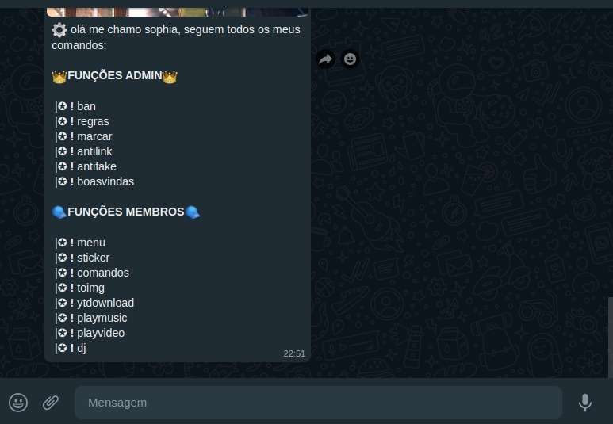

# sophy-bot

> Status do Projeto: concluido ✅

## bibliotecas

## sobre o bot

<b>chatbot</b> do whatsapp criado com uso da biblioteca <a href="https://www.npmjs.com/package/@adiwajshing/baileys">Baileys</a> feito em <b>Typescript</b>,
o objetivo do bot é auxiliar em administração de grupos de whatsapp.

### funções 
<table>
<tr>
<th>
função
</th>
<th>
status
</th>
</tr>
<tr>
<td>
enviar texto
</td>
<td>
OK
</td>
</tr>
<tr>
<td>
responder mensagem
</td>
<td>
OK
</td>
</tr>
 <tr>
 <td>
marcar numero
</td>
<td>
OK
</td>
  </tr>
   <tr>
 <td>
enviar audio/musica
</td>
<td>
OK
</td>
  </tr>
    <tr>
 <td>
enviar botões
</td>
<td>
OK
</td>
  </tr>
     <tr>
 <td>
enviar figurinhas
</td>
<td>
OK
</td>
  </tr>
     <tr>
 <td>
enviar vídeos
</td>
<td>
OK
</td>
  </tr>
</table>

## comandos
<ul>
  <li><b>comandos:</b> exibe todos os comandos disponíveis do bot </li>
  <li><b>menu:</b> exibe as informações e o menu do bot</li>
  <li><b>sticker:</b> transforma gifs e imagens em figurinhas</li>
   <li><b>toimg:</b> converter figurinha em imagem</li>
    <li><b>ban:</b> remove usuario de grupo</li>
     <li><b>regras:</b> exibe a descrição do bot</li>
      <li><b>marcar:</b> marcar todos os membros de um grupo</li>
       <li><b>ytdownload:</b> baixa video do youtube e envia</li>
        <li><b>playmusic:</b> procura musica no youtube e envia</li>
        <li><b>playvideo:</b> procura video no youtube e envia</li>
        <li><b>dj:</b> enviar mix de musicas de alguma banda/cantor(a)</li>
         <li><b>antilink:</b> proibe link</li>
         <li><b>antifake:</b> proibe numeros fakes/estrangeiros nos grupos</li>
</ul>

### instalação(emuladores de terminal & distros Linux):

>bash install.sh && bash start.sh

###  instalação (windows e outros)

>yarn install

>yarn run build

>yarn start
